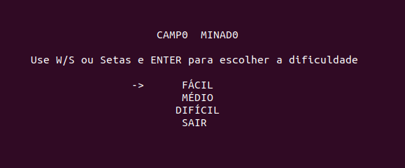
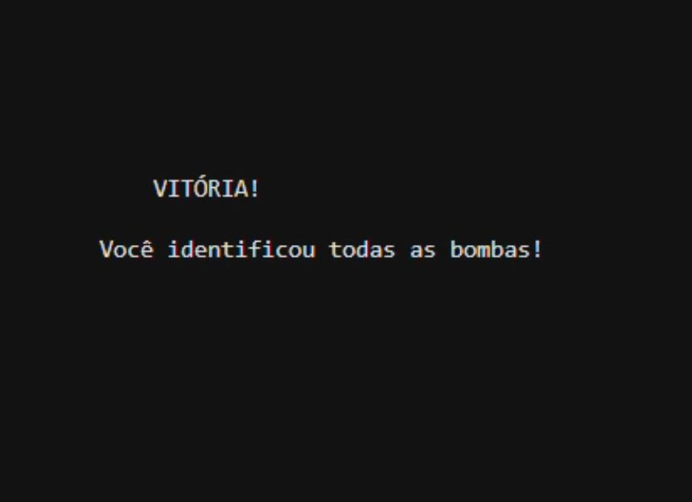
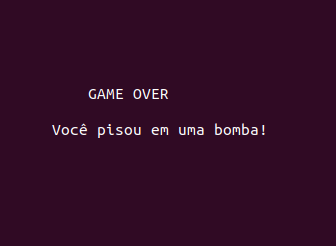
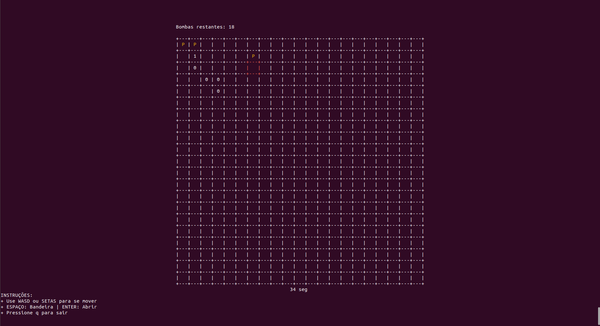

<div align="center">

# 💣 Campo Minado em Haskell


<br />

<p align="center">
  <b>Uma implementação puramente funcional do clássico jogo de estratégia.</b><br>
  Desenvolvido para a disciplina de <i>Paradigmas de Linguagens de Programação</i> da <b>UFCG</b>.
</p>

[Funcionalidades](#funcionalidades-do-projeto) • [Demonstração](#demonstração) • [Estrutura](#estrutura-do-projeto) • [Instalação](#configuração-e-instalação) • [Autores](#autores)

</div>

<div style="border-bottom: 3px solid #5e5086;"></div>

---

## Visão Geral

Este projeto é uma implementação do clássico jogo **Campo Minado** (Minesweeper) desenvolvido inteiramente em **Haskell**. O objetivo principal é aplicar conceitos fundamentais do **Paradigma Funcional** — como imutabilidade, recursão e funções puras — em uma aplicação interativa executada via terminal.

---

## Funcionalidades do Projeto

O jogo é totalmente executado no terminal (`CLI`) e conta com as seguintes características:

1. **Menu Principal:** Seleção de dificuldade (Fácil, Médio, Difícil) e opção de sair.
2. **Navegação:** Cursor controlado pelas setas do teclado.
3. **Lógica de Jogo:** Distribuição de bombas aleatória, cálculo de vizinhos e detecção de vitória/derrota.
4. **Estados do Jogo:** Vitória, Derrota e contagem de bombas restantes.
5. **Ranking:** Sistema de pontuação com persistência de melhores tempos.
6. **Interface:** Desenho do tabuleiro em ASCII com destaque para a célula selecionada.

---

## Demonstração

<div align="center">
  <table>
    <tr>
      <td align="center">
        
        <br><sub><b>Menu Principal</b></sub>
      </td>
      <td align="center">
        
        <br><sub><b>Vitória</b></sub>
      </td>
      <td align="center">
        
        <br><sub><b>Derrota</b></sub>
      </td>
    </tr>
  </table>
  <br />
    
  <br>
  <sub><b>Tabuleiro em Execução</b></sub>
</div>


## Estrutura do Projeto

O código foi modularizado para garantir legibilidade e facilitar a manutenção:

| Arquivo | Descrição |
| :--- | :--- |
| `src/Main.hs` | Ponto de entrada e inicialização do jogo. |
| `src/Interface/PreparaJogo.hs` | Configuração do menu e visualização do tabuleiro. |
| `src/Interface/Cursor.hs` | Controle de navegação e seleção de células. |
| `src/Interface/Cronometro.hs` | Gerenciamento da contagem de tempo. |
| `src/Interface/Ranking.hs` | Sistema de pontuação e recordes. |
| `src/Interface/FinalizaJogo.hs` | Exibição das telas de vitória e derrota. |
| `src/Jogo/Jogo.hs` | Loop principal e controle de estados. |
| `src/Jogo/Logica.hs` | Regras do jogo e manipulação do tabuleiro. |
| `src/Jogo/Types.hs` | Definição dos tipos de dados utilizados. |

---

## Configuração e Instalação

Este projeto utiliza o **Haskell Stack** para gerenciamento de dependências.

### Pré-requisitos

* [Haskell Stack](https://docs.haskellstack.org/en/stable/README/) instalado.
* Terminal com suporte a *ANSI escape codes* (Linux, macOS ou Windows via WSL/PowerShell).

### Passo a Passo

1.  **Clone o repositório:**

    ```bash
    git clone [https://github.com/SEU-USUARIO/campo-minado-haskell.git](https://github.com/SEU-USUARIO/campo-minado-haskell.git)
    cd campo-minado-haskell
    ```

2.  **Compile e execute o projeto:**

    ```bash
    stack setup
    stack build
    stack run
    ```

---

## Autores

Este projeto foi desenvolvido pelos alunos:

<table>
  <tr>
    <td align="center">
      <a href="https://github.com/annegmsilva">
        <br>
        <sub><b>Anne Grazieli</b></sub>
      </a>
    </td>
    <td align="center">
      <a href="https://github.com/joycevnr">
        <br>
        <sub><b>Joyce Vitória</b></sub>
      </a>
    </td>
    <td align="center">
      <a href="https://github.com/Eduarda-Cabral">
        <br>
        <sub><b>Maria Eduarda</b></sub>
      </a>
    </td>
    <td align="center">
      <a href="https://github.com/Pedroz007">
        <br>
        <sub><b>Pedro Henrique</b></sub>
      </a>
    </td>
     <td align="center">
      <a href="https://github.com/Thiago-Barbos">
        <br>
        <sub><b>Thiago Barbosa</b></sub>
      </a>
    </td>
  </tr>
</table>
